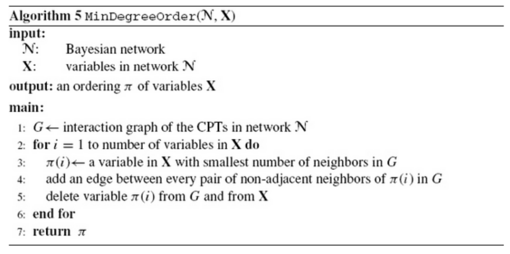
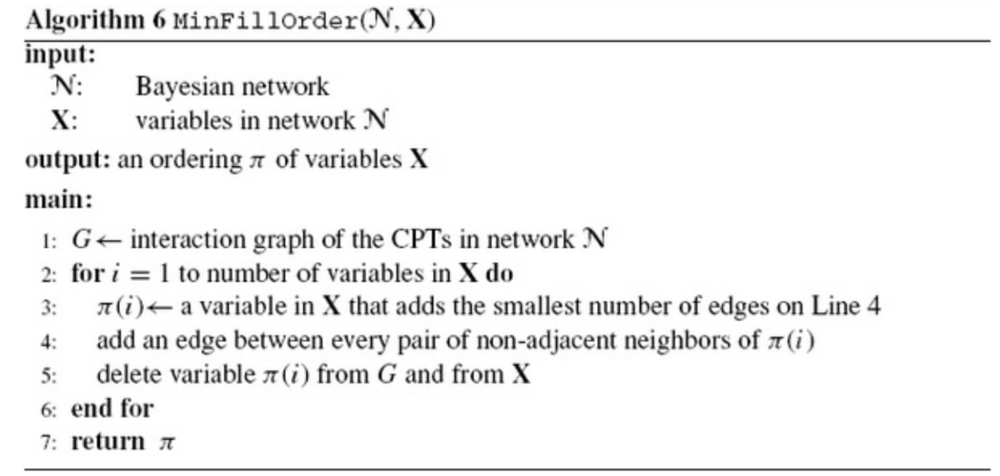

# Bayesian Networks 
## Progetto

Il progetto sulle reti bayesiene prevede si realizzare una serie di metodi compatibili con la libreria aima-core per ottimizzare metodi esistenti e implementare nuove caratteristiche. 

Il progetto si divide in 2 parti: 

   **1.** **Estensione Variable Elimination (VE)** algoritmo di inferenza su `Bayesian Networks`,

   **2.** **Rollup Filtering**  algoritmo di inferenza su `Dynamic Bayesian Networks` (DBNs).

### Estensione Variabile Elimination

Lo scopo di questa parte è di realizzare diverse procedure al fine di ridurre la dimensione delle rete, effettuando pruning di archi e nodi irrelevanti. Oltre alla grandezza delle rete un altro fattore che influisce sull'efficiente della VE è l'ordine con cui vengono processate le variabili. Di seguito sono elencate le tecniche utilizzate e le teorie su cui si basano:
1. Pruning Nodi irrilevanti (criterio Ancestor)
2. Pruning Nodi irrilevanti (criterio m-separation)
3. Pruning Archi irrilevanti
4. Ordinamento dei fattori

#### 1. Pruning Nodi irrilevanti (criterio Ancestor)

Il pruning dei nodi irrelevanti è stato implementato sulla base del seguente teorema:

**Theorem 1** : Una variabile M è irrilevante in una rete BN se per rispondere ad una query Q(X = var_query, E = evidence) se M ∉ `Ancestor( X ∪ E )`.
- Ancestor(X) : indica tutti i genitori/progenitori di X

#### 2. Pruning Nodi irrilevanti (criterio m-separation)

**Def `moral graph`** : Un grafo morale di una rete bayesiana è un grafo non direzionato e si ottiene legando tra i loro tutti i genitori che condividono almeno un figlio eliminando la direzione delle frecce.

** Def: `m-saperation`** Un insieme di variabile A è m-separata da un insieme B da un terzo insieme di variabili C (o meglio dire che è C il separatore fra A e B), se e solo se ∀ a1, b1 | a1 ∈ A ∧ b1 ∈ B non esiste un percorso p che contiene c | ∀c ∈ C .

Sulla base di queste due definizione diamo una nuova definizione di nodi irrelevanti :

**Theorem 2** : Un insieme di variabili M è irrilevante in una rete BN per rispondere ad una query Q(X = var_query, E = evidence) se M è m-separated from X by E.

Il risultato di queste 2 operazioni di pruning dei nodi è denotato con **pruneNodes(BN,e)**.

#### 3. Pruning Archi irrilevanti

Data una rete bayesiane **BN** ed una query**(Q, e)** si possono eliminare alcuni archi e di conseguenza ridurre le entry di alcune CPT senza intaccare la correttezza della query(Q,e). In particolare per ogni arco U --> X che ha origine (è uscente) da un nodo n ∈ e (gli archi che escono da uno dei nodi di evidenza). Noi possiamo:
- Rimuovere l’arco U --> X (come se X perde un padre). 
- Rimpiazzare la CPT Θ X|U per il nodo X da una CPT ridotta, ottenuta da Θ X|U, dalla CPT di X|U andremo a prendere solo le righe che concordano sul valore u del genitore specifico U data l’evidenza e. La nuova CPT corrisponde 

**Theorem 3** : Data una rete BN ed e un istanziazione di variabili. Se BN’ = pruneEdges(BN,e) allora Pr(Q, e) = Pr’(Q, e) dove Pr e Pr’ sono le distruzioni di probabilità indotte sulle reti BN e BN’ rispettivamente.

Il risultato di quest’operazione è denotato con **pruneEdges(BN,e)**.

#### 4. Ordinamento dei fattori

L'ordine con cui vengono processati le variabili nell'algoritmo della VE è un fattore che influisce sulla complessità temporale del problema. Di seguito sono illustrate alcuni algoritmi che trovano un ordinamento euristico sulle variabili, in quanto la complessità per trovare un ordinamento ottimale è NP-Complete e richiederebbe più tempo dell'esecuzione delle VE stessa.

**Def `interation graph`** : Sia f1 ... fn un insieme di fattori. Il grafo di interazione G di questi fattori è un grafo indiretto costruito come segue. I nodi di G sono le variabili che appaiono nei fattori f1 ... fn . C’è un arco tra ogni coppia di variabili se esse appaiono nello stesso fattore.

E’ possibile determinare un ordine euristico e non ottimale delle variabili da computare nella VE che si basa sull’ integration graph.

Di seguito 2 algoritmi :

  

  

### Rollup Filtering algorithm

e rete bayesiane dinamiche (DBN) sono reti bayesiane che mettono in relazione variabili tra istantidi tempo successivi. Vengono utilizzate per modellare serie temporali e poichè sono una generaliz-zazione degli hidden Markov model e dei Kalman filter, ricadono sotto l’assunzione markoviana.Per questo sono spesso chiamate 2TBN (two-time slice bayesian network).Come per gli altri modelli temporali, una delle operazioni di inferenza possibili su questo tipodi reti è il filtering, ovvero: P(Xt|E1:t), doveXtrappresenta le variabili di stato eE1:tla seriedi evidenze nell’intervallo temporale[1 :t]. Sarebbe possibile eseguire questo tipo di operazionetramite unrolling completo della rete, considerando la rete ottenuta come un BN statica e facendoun’operazione di VE. Questa operazione però non sarebbe ottimale dal punto di vista del tempo edell’utilizzo delle risorse; per questo motivo viene spesso utilizzata una tecnica che prende il nomediRollup Filtering. A differenza dell’unrolling completo, con questo approccio si va a considerarela rete maniera iterativa in un intervallo temporale[t−1 :t].

# Project management

## Development

Dato che nella libreria **aima-core** molte delle classi relative alla struttura delle BN non permettono la modifica di alcuni campi, sono state implementate le seguente classi al fine di permetterlo. In particolare con l'utilizzo delle seguenti classi è possibile l'eliminare un nodo dall BN (con il conseguente aggiornamento della CPT del genitore, qualora fosse presente), eliminare archi  e cambiare a run-time le CPT dei nodi della rete. Di seguito le classi:

  - `bayes.struct.FullCPTNodeEd.java`, simile alle classe FullCPTNode.java con l'unica differenza che associa ad FullCPTNode una bayes.struct.EditableCPT

  - `bayes.struct.EditableCPT.java`, simile alle classe CPT.java con l'unica differenza che permette la get e la set della ProbabilityTable associata.

  - `bayes.struct.EditableNode.java`, simile alle classe AbstractNode.java con la possibilità di eliminare un nodo figlio o un nodo genitore.

  - `bayes.struct.EditableBayesianNetwork.java`, simile alla classe BayesNet.java che permette la rimozione di un nodo con il conseguente aggiornamento delle CPT del padre (qualora fosse presente).
  
Oltre alle classi necessarie per la struttura delle reti è stata implementata anche la classe  `MoralGraph.java` che data in input una rete bayesiane costruisce il relativo grafo morale, e classe `InterationGraph.java` che data una lista di fattori costruisce il relativo di grafo di interazione.

## Authors

- Iodice Franesco
- Valentino Di Cianni
- Carlo Alberto Barbano
